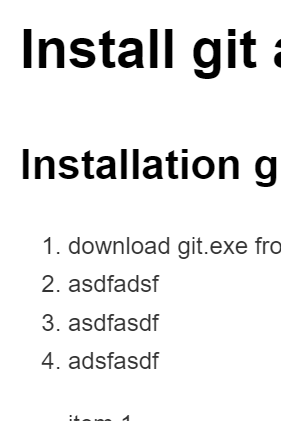

# Install git and github

## Installation git

1. download git.exe from git-scm.com 
2. asdfadsf
3. asdfasdf
4. adsfasdf

- item 1
- item 2

[Seite des österreichischen Rundfunk](www.orf.at)



Dieser **Text** ist *fett*.

```cs
public static int Search(int[] array, int target)
    {
        int left = 0;
        int right = array.Length - 1;

        while (left <= right)
        {
            int mid = left + (right - left) / 2;

            if (array[mid] == target)
                return mid;

            if (array[mid] < target)
                left = mid + 1;
            else
                right = mid - 1;
        }

        return -1; // Target not found
    }
```
